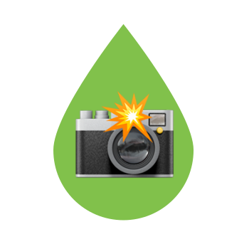

<h1 align="center"><br />eksiShot</h1>

eksiShot, [ekşi sözlük](https://www.eksisozluk.com)'teki entryleri resimlere dönüştürmek ve entry ekran görüntüleri almak için ücretsiz bir araçtır.

### 🇬🇧 English
A free tool that converts entries on [ekşi sözlük](https://www.eksisozluk.com) into images and takes screenshots of entry pages.

## Önizleme
eksiShot, [eksishot.vercel.app](https://eksishot.vercel.app) adresi üzerinden kullanılabilir.

Arama çubuğuna entry adresini girin ve `Enter` tuşuna basarak aratın. Ardından entry görüntüsünü indirmek için `Görüntüyü İndir` butonuna tıklayın.

> **VPN Kullanın**
> eksisozluk.com adresine getirilen erişim engelinden dolayı Türkiye lokasyonlu bağlantılarda VPN kullanmalısınız.

> **Allow CORS Eklentisini Yükleyin**
> Tarayıcılarda varsayılan olarak farklı kaynaklardan veri almak engellenir. Bu eklentiyi etkinleştirerek, engellemeyi ortadan kaldırabilirsiniz. [Allow CORS Chrome Eklentisi](https://chrome.google.com/webstore/detail/allow-cors-access-control/lhobafahddgcelffkeicbaginigeejlf?hl=en)

## Özellikler
- Entry bilgilerini getirir ve resime çevirir.

## Ekran Görüntüsü


## Dizin Yapısı
```bash
├── public
├── src
│   ├── components
│   │   ├── Entry.jsx
│   │   ├── Footer.jsx
│   │   └── Header.jsx
│   ├── utility
│   │   └── getEntryId.js
│   ├── provider
│   │   └── EntryContext.jsx
│   ├── App.jsx
│   ├── index.css
│   └── main.jsx
├── README.md
├── tailwind.config.cjs
└── vite.config.js
```

## Katkıda Bulunma
Hata raporları, özellik talepleri ve pull request'leri memnuniyetle karşılanmaktadır. Bu proje, işbirliği için güvenli ve hoşgörülü bir ortam olmayı amaçlamaktadır ve katkıda bulunanların, Katılımcı Anlaşması'nın davranış kurallarına uyması beklenmektedir.

## Destek
- Bu repo'ya yıldız ver.
- GitHub üzerinden bana sponsor ol.
- Beni Twitter'dan ya da GitHub'dan takip et: [@emreshepherd](https://twitter.com/emreshepherd) - [@emrecoban](https://github.com/emrecoban).
- Bana kahve ısmarla: https://www.buymeacoffee.com/emrecoban

## Kullanılan Teknolojiler
- TailwindCSS
- ReactJS
- Axios
- Cheerio

## Lisans
eksiShot, MIT Lisansı şartları altında açık kaynak olarak kullanıma sunulmaktadır.